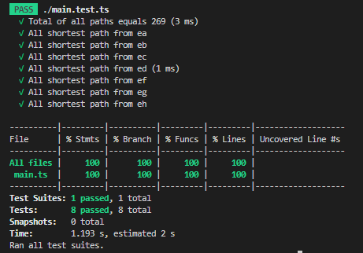

# Question 1 
Use the following undirected graph ­- nodes can be visited only once

a. Write a function that returns all the possible paths between A­-H.

b. Write a function that returns the shortest path between A­-H.

## How to run
```javascript
npm start
```

The results are shown below:
```
PS C:\Users\Mark\Documents\Repository\moovup-test\question1> npm start

> question1@1.0.0 start
> npx tsc && node .\dist\index.js

a. Write a function that returns all the possible paths between A­-H.
[
  'ab',      'ad',      'ah',       'abc',      'abd',      'adb',
  'adc',     'ade',     'ahe',      'ahg',      'abcd',     'abcf',
  'adbc',    'adef',    'adeh',     'ahed',     'ahef',     'abcde',
  'abcfg',   'adbcf',   'adehg',    'ahedb',    'ahedc',    'ahefg',
  'abcdef',  'abcdeh',  'adbcfe',   'adbcfg',   'ahedbc',   'abcdefg',
  'adbcfeh', 'ahedbcf', 'abcdefgh', 'adbcfehg', 'ahedbcfg', 'ba',
  'bc',      'bd',      'bad',      'bah',      'bcd',      'bcf',
  'bda',     'bdc',     'bde',      'badc',     'bade',     'bahg',
  'bcda',    'bcde',    'bcfg',     'bdah',     'bdcf',     'badcf',
  'badeh',   'bcdah',   'bcdef',    'bdahe',    'bdahg',    'badcfe',
  'badcfg',  'bcdahe',  'bcdahg',   'bdahef',   'badcfeh',  'bcdahef',
  'bdahefc', 'bdahefg', 'badcfehg', 'bcdahefg', 'cb',       'cd',
  'cf',      'cba',     'cbd',      'cda',      'cdb',      'cde',
  'cfe',     'cfg',     'cbad',     'cbah',     'cdab',     'cdah',
  'cdef',    'cfed',    'cfeh',     'cbade',    'cbahg',    'cdahe',
  'cdahg',   'cfeda',   'cfedb',    'cfehg',    'cbadef',   'cbadeh',
  'cdahef',  'cfedab',  'cfedah',   'cbadefg',
  ... 169 more items
]
b. Write a function that returns the shortest path between A­-H.
{
  ab: 'ab',
  ac: 'abc',
  ad: 'ad',
  ae: 'ade',
  af: 'abcf',
  ag: 'ahg',
  ah: 'ah',
  ba: 'ba',
  bc: 'bc',
  bd: 'bd',
  be: 'bde',
  bf: 'bcf',
  bg: 'bahg',
  bh: 'bah',
  ca: 'cba',
  cb: 'cb',
  cd: 'cd',
  ce: 'cde',
  cf: 'cf',
  cg: 'cfg',
  ch: 'cbah',
  da: 'da',
  db: 'db',
  dc: 'dc',
  de: 'de',
  df: 'dcf',
  dg: 'dahg',
  dh: 'dah',
  ea: 'eda',
  eb: 'edb',
  ec: 'edc',
  ed: 'ed',
  ef: 'ef',
  eg: 'efg',
  eh: 'eh',
  fa: 'fcba',
  fb: 'fcb',
  fc: 'fc',
  fd: 'fcd',
  fe: 'fe',
  fg: 'fg',
  fh: 'feh',
  ga: 'gha',
  gb: 'gfcb',
  gc: 'gfc',
  gd: 'gfcd',
  ge: 'gfe',
  gf: 'gf',
  gh: 'gh',
  ha: 'ha',
  hb: 'hab',
  hc: 'habc',
  hd: 'had',
  he: 'he',
  hf: 'hef',
  hg: 'hg'
}
```

# Test result 

By running the following script, you can get the testing result
```javascript
npm test
```



### To-do
- Descript how it works
- runtime environment
- linting
- function descriptions, parameters descriptions